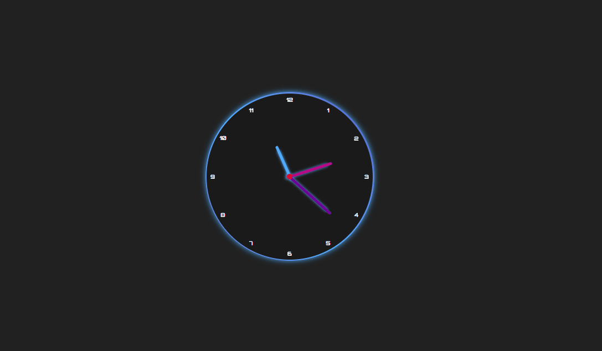

# AnalogClock
AnalogClock front end project using Javascript, HTML and CSS.

The project is available at: [https://analog-clock-azure.vercel.app/](https://analog-clock-azure.vercel.app/)

  

The tutorial of this project is available at: [Youtube tutorial link](https://www.youtube.com/watch?v=K6wsnJbUsGQ)
